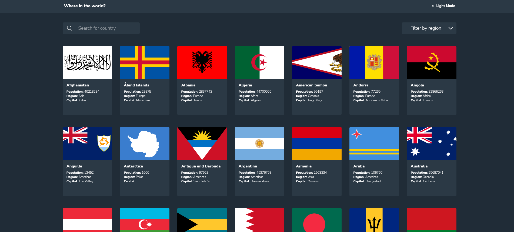
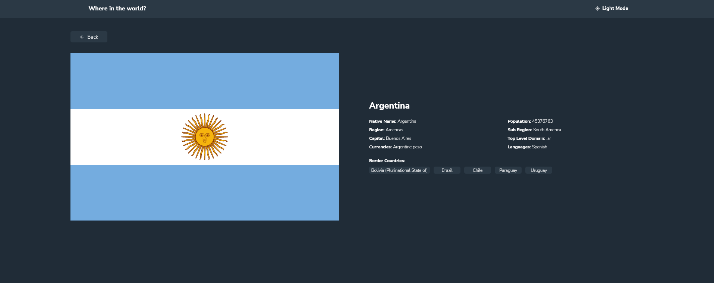

# Frontend Mentor - REST Countries API with color theme switcher solution

This is a solution to the [REST Countries API with color theme switcher challenge on Frontend Mentor](https://www.frontendmentor.io/challenges/rest-countries-api-with-color-theme-switcher-5cacc469fec04111f7b848ca). Frontend Mentor challenges help you improve your coding skills by building realistic projects. 

## Table of contents

- [Frontend Mentor - REST Countries API with color theme switcher solution](#frontend-mentor---rest-countries-api-with-color-theme-switcher-solution)
  - [Table of contents](#table-of-contents)
  - [Overview](#overview)
    - [The challenge](#the-challenge)
    - [Screenshot](#screenshot)
    - [Links](#links)
  - [My process](#my-process)
    - [Built with](#built-with)
    - [What I learned](#what-i-learned)
    - [Continued development](#continued-development)
    - [Useful resources](#useful-resources)
  - [Author](#author)

## Overview

### The challenge

Users should be able to:

- See all countries from the API on the homepage
- Search for a country using an `input` field
- Filter countries by region
- Click on a country to see more detailed information on a separate page
- Click through to the border countries on the detail page
- Toggle the color scheme between light and dark mode *(optional)*

### Screenshot

**Main page**

**Country information**

### Links

- Solution URL: [https://github.com/evertzner/rest-countries-api-with-color-theme-switcher-master](https://github.com/evertzner/rest-countries-api-with-color-theme-switcher-master)
- Live Site URL: [https://resilient-chebakia-1ae802.netlify.app/](https://resilient-chebakia-1ae802.netlify.app/)

## My process

### Built with

- Semantic HTML5 markup
- CSS custom properties
- SCSS
- Flexbox
- CSS Grid
- [React](https://reactjs.org/) - JS library
- [Redux Toolkit](https://redux-toolkit.js.org/) - Redux
- [Axios](https://axios-http.com/) - Promise based HTTP client

### What I learned

I use this project to have a big focus on react, redux, using APIs and improving look & feel technics.

Redux to store data and not calling API everytime I need to filter.

Partial SCSS to have organized styling in modules.

### Continued development

I want to get more in deep into Redux as it is a powerful tool to manage data into an application.

### Useful resources

- [Zero To Mastery](https://www.udemy.com/course/complete-react-developer-zero-to-mastery/) - Udemy course 'Complete React Developer in 2022 (w/ Redux, Hooks, GraphQL)' from 'Zero to Mastery' 
- [Maximilian Schwarzmüller](https://www.udemy.com/course/react-the-complete-guide-incl-redux/) - Udemy course 'React - The Complete Guide (incl Hooks, React Router, Redux)' from 'Maximilian Schwarzmüller' 
- [Kevin Powell](https://www.youtube.com/kepowob) - Amazing YouTube channel to learn all about CSS.
- [Web Dev Simplified](https://www.youtube.com/c/WebDevSimplified) - Awesome YouTube channel to learn everything about web development.

## Author

- GitHub - [evertzner](https://github.com/evertzner)
- Frontend Mentor - [@evertzner](https://www.frontendmentor.io/profile/evertzner)
